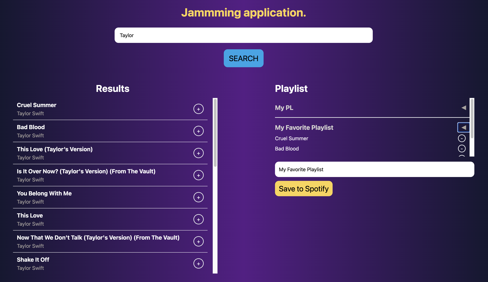

# Screenshot

# Links
- Live site URL: [Link Demo](https://jammming-woad.vercel.app/)

# The purpose of your project
- Try to fetch data from Open Source API (Spotify)

---
# Technologies used
- TailwindCSS
- JavaScript
- React
- HTTP Requests and Responses
- Authentication
- cURL to make API calls. 

---
# Features
- Users can search for songs by song title.
- You can also include functionality to search by other attributes like artist’s name, genre, etc.
- Users can see information about each song like title, artist, and album for songs they queried
  
---
# Future work
- Connect with Backend
- Fix bugs
---